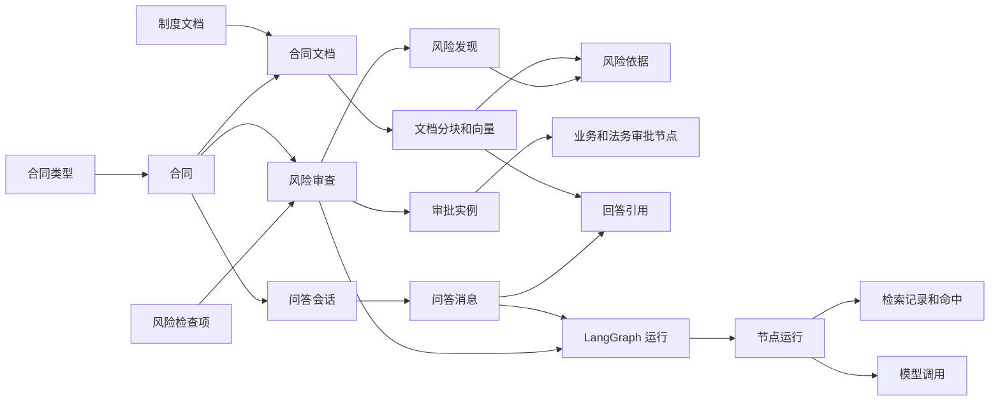
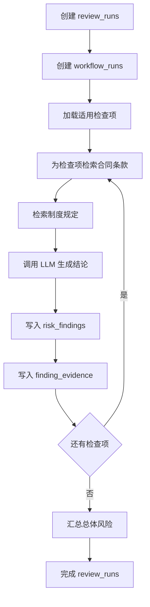

# 智能审批辅助平台数据库设计

## 1. 设计范围

本设计面向单企业演示项目，暂不包含租户、用户、角色和权限模型。平台支持：

- 采购合同和销售合同。
- 当前合同条款与企业制度的统一 RAG 检索。
- 预定义检查项驱动的 LangGraph 风险审查。
- 业务审批、法务审批两级人工审批。
- 基于合同和风险报告的多轮问答。
- LangGraph 节点、向量检索和模型调用的执行追踪。
- Redis + Celery 异步任务；PostgreSQL 保存最终业务状态。

## 2. 技术约定

- PostgreSQL 17。
- `pgvector` 扩展用于向量存储与余弦相似度检索。
- 主键统一使用 UUID，由 `pgcrypto` 的 `gen_random_uuid()` 生成。
- 时间统一使用 `TIMESTAMPTZ`。
- 状态字段使用 `VARCHAR + CHECK`，方便后续通过数据库迁移扩展。
- 非固定结构的模型结果、LangGraph State 和扩展元数据使用 `JSONB`。
- 当前初始化脚本使用 `VECTOR(1536)`，适配 1536 维 Embedding；更换向量维度时需要迁移字段并重新生成全部向量。

## 3. 核心数据关系



合同文档与制度文档统一存储在 `documents` 中，通过 `document_type` 区分；所有可检索内容统一存储在 `document_chunks` 中，因此风险检查和问答可以复用同一个向量检索器。

## 4. 表结构总览

### 4.1 合同与知识库

#### `contract_types` — 合同类型

保存采购合同 `PURCHASE` 和销售合同 `SALES`。检查项通过范围关联表绑定适用的合同类型。

| 关键字段 | 类型 | 说明 |
|---|---|---|
| `id` | UUID | 主键 |
| `code` | VARCHAR(32) | 唯一业务编码 |
| `name` | VARCHAR(64) | 类型名称 |
| `enabled` | BOOLEAN | 是否启用 |

#### `contracts` — 合同主表

| 关键字段 | 类型 | 说明 |
|---|---|---|
| `contract_no` | VARCHAR(64) | 唯一合同编号 |
| `contract_type_id` | UUID | 合同类型 |
| `counterparty` | VARCHAR(255) | 合同相对方 |
| `amount` | NUMERIC(18,2) | 合同金额，可空 |
| `status` | VARCHAR(32) | 合同业务状态 |

主要状态流转：

```text
DRAFT -> PARSING -> READY -> REVIEWING -> PENDING_APPROVAL
                                              |-> APPROVED
                                              |-> REJECTED
                                              `-> RETURNED
```

#### `documents` — 文档

统一管理合同和制度文件。

| 关键字段 | 类型 | 说明 |
|---|---|---|
| `document_type` | VARCHAR(32) | `CONTRACT` 或 `POLICY` |
| `contract_id` | UUID | 合同文档必填，制度文档为空 |
| `revision_no` | INTEGER | 合同修订版本号 |
| `is_current` | BOOLEAN | 是否为当前合同版本 |
| `storage_uri` | TEXT | 文件存储位置 |
| `file_hash` | VARCHAR(64) | 文件 SHA-256 |
| `parse_status` | VARCHAR(32) | 解析状态 |
| `raw_text` | TEXT | 解析后的完整文本 |
| `metadata` | JSONB | 页数、解析器等扩展数据 |

部分唯一索引保证同一合同只有一个当前版本，并且修订号不重复。

#### `document_chunks` — 文档分块与向量

| 关键字段 | 类型 | 说明 |
|---|---|---|
| `document_id` | UUID | 所属文档 |
| `chunk_index` | INTEGER | 文档内分块序号 |
| `chunk_type` | VARCHAR(32) | 合同条款或制度段落 |
| `clause_no` | VARCHAR(64) | 原始条款编号 |
| `content` | TEXT | 分块正文 |
| `embedding` | VECTOR(1536) | 文本向量 |
| `embedding_model` | VARCHAR(128) | Embedding 模型名称 |
| `metadata` | JSONB | 页码定位等扩展信息 |

`embedding` 建立 HNSW 余弦距离索引。应用检索时必须按当前合同文档和制度文档过滤，避免检索到其他合同内容。

### 4.2 风险检查配置

#### `review_check_items` — 风险检查项

当前演示版本启用付款、质保、违约责任和争议解决四项检查；其他预置检查项通过迁移停用但不删除，避免破坏历史引用。

保存付款、交付、验收、违约责任、解除终止和争议解决等预定义检查项。`prompt_template` 是该检查节点的专用指令，`sort_order` 控制工作流展示顺序。

#### `review_check_item_scopes` — 检查项适用范围

由 `check_item_id + contract_type_id` 构成联合主键。一个检查项可以同时适用于采购和销售合同。

### 4.3 风险审查结果

#### `review_runs` — 风险审查

代表一次完整的合同审查业务任务。`contract_document_id` 固定本次审查使用的合同版本，保证合同修改后仍能追溯历史报告。

| 关键字段 | 说明 |
|---|---|
| `status` | 等待、运行、成功、失败或取消 |
| `overall_risk_level` | 总体低、中、高风险 |
| `summary` | 总体结论 |
| `approval_suggestion` | 建议通过、修改后通过或驳回 |

#### `risk_findings` — 风险发现

一个审查任务对每个检查项最多产生一条结构化结论。`structured_output` 保存模型返回的完整结构化内容，常用字段拆分为普通列，方便查询和统计。

#### `finding_evidence` — 风险依据

把风险发现关联到具体的合同条款或制度分块，同时保存相关度和最终引用文本。页面可直接展示“风险结论—合同条款—制度依据”的证据链。

### 4.4 两级审批

#### `approval_instances` — 审批实例

绑定合同和风险审查报告，记录当前节点、总体状态和最终决定。合同退回并重新提交后应创建新的审批实例，保留原审批历史。

#### `approval_steps` — 审批节点

每个实例初始化两个节点：

1. `BUSINESS`：业务审批。
2. `LEGAL`：法务审批。

当前暂不设计用户表，因此使用 `approver_name` 记录操作人；以后可增加 `approver_id` 外键。

### 4.5 合同问答

#### `chat_sessions`

每个会话绑定一份合同，可选绑定某次风险报告。

#### `chat_messages`

保存用户、助手和系统消息，并记录模型、Token 用量及响应耗时。

#### `chat_message_citations`

保存 AI 回答引用的合同条款或制度分块，用于前端展示可追溯引用。

### 4.6 LangGraph 与 RAG 可观测性

#### `workflow_runs`

记录一次风险审查或合同问答的 LangGraph 运行。业务结果保存在业务表，`state_snapshot` 仅用于追踪和调试。

#### `workflow_node_runs`

记录每个节点的顺序、状态、输入输出摘要、耗时和异常。建议不要在 `input_data` 中保存 API Key 或完整敏感文件。

#### `retrieval_runs` 与 `retrieval_hits`

分别记录检索请求和命中结果，包括查询文本、过滤条件、Top K、排名、相似度，以及最终是否被送入模型上下文。

#### `llm_calls`

记录模型服务商、模型名称、提示词用途、Token 用量、耗时、状态和结构化输出。

### 4.7 Celery 任务

#### `async_jobs`

Redis/Celery 负责任务分发，`async_jobs` 保存可查询、可追踪的最终状态。目前支持：

- `DOCUMENT_PARSE`：文档解析。
- `DOCUMENT_EMBEDDING`：分块及向量化。
- `RISK_REVIEW`：LangGraph 风险审查。

`resource_type + resource_id` 指向任务处理的业务对象。它是有意设计的轻量多态关联，由服务层校验资源是否存在。

## 5. LangGraph 数据落库边界



`workflow_*`、`retrieval_*`、`llm_calls` 是技术追踪数据；`review_runs`、`risk_findings`、`finding_evidence` 是稳定的业务结果。即使以后清理部分详细运行日志，也不会影响审批报告。

## 6. 初始化脚本

| 文件 | 用途 |
|---|---|
| `database/init/001_schema.sql` | 创建扩展、20 张表、索引、约束和触发器 |
| `database/init/002_seed.sql` | 初始化两种合同类型和六个风险检查项 |

初始化脚本由 `compose.yaml` 只读挂载到 `/docker-entrypoint-initdb.d`，仅在数据库数据卷首次创建时自动执行。
